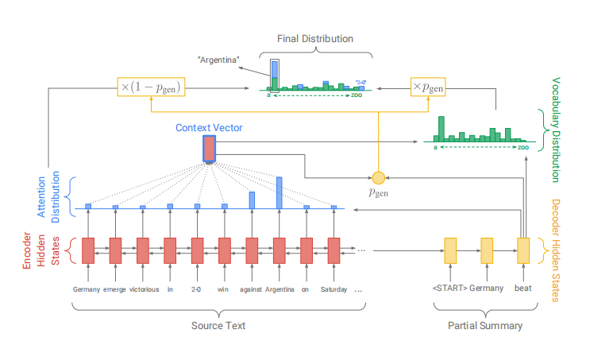
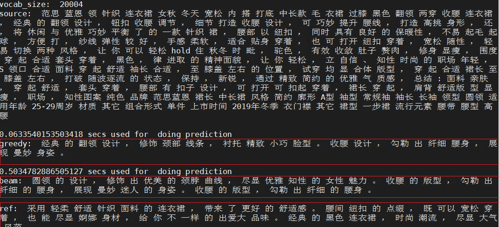
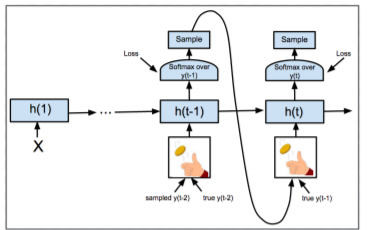

# summary generator
### 文本摘要生成
使用keras实现paper：Get To The Point: Summarization with Pointer-Generator Networks
#### 一、模型结构
  

分三步实现论文：

1、Sequence-to-sequence attentional model

Equation(1)：

)
```python
# Define feed-forward layers.
self.Wh = nn.Linear(2*hidden_units, 2*hidden_units, bias=False)
self.Ws = nn.Linear(2*hidden_units, 2*hidden_units)

# calculate attention scores
# Wh h_* (batch_size, seq_length, 2*hidden_units)
encoder_features = self.Wh(encoder_output.contiguous())
# Ws s_t (batch_size, seq_length, 2*hidden_units)
decoder_features = self.Ws(s_t)
# (batch_size, seq_length, 2*hidden_units)
att_inputs = encoder_features + decoder_features

# (batch_size, seq_length, 1)
score = self.v(torch.tanh(att_inputs))
```

Equation(2)：

)
```python
# (batch_size, seq_length)
attention_weights = F.softmax(score, dim=1).squeeze(2)
attention_weights = attention_weights * x_padding_masks
# Normalize attention weights after excluding padded positions.
normalization_factor = attention_weights.sum(1, keepdim=True)
attention_weights = attention_weights / normalization_factor
```

Equation(3)：


```python
# (batch_size, 1, 2*hidden_units)
context_vector = torch.bmm(attention_weights.unsqueeze(1),
                           encoder_output)
```

Equation(4)：

+b^{\prime}))
```python
# concatenate context vector and decoder state
# (batch_size, 3*hidden_units)
decoder_output = decoder_output.view(-1, config.hidden_size)
concat_vector = torch.cat(
    [decoder_output,
     context_vector],
    dim=-1)

# calculate vocabulary distribution
# (batch_size, hidden_units)
FF1_out = self.W1(concat_vector)
# (batch_size, vocab_size)
FF2_out = self.W2(FF1_out)
# (batch_size, vocab_size)
p_vocab = F.softmax(FF2_out, dim=1)
```

Equation(6)：

)
```python
# Do smoothing to prevent getting NaN loss because of log(0).
loss = -torch.log(target_probs + config.eps)
```

Equation(7)：


```python
sample_losses = torch.sum(torch.stack(step_losses, 1), 1)
# get the non-padded length of each sequence in the batch
seq_len_mask = torch.ne(y, 0).byte().float()
batch_seq_len = torch.sum(seq_len_mask, dim=1)

# get batch loss by dividing the loss of each batch
# by the target sequence length and mean
batch_loss = torch.mean(sample_losses / batch_seq_len)
```

2、Pointer-generator network

Equation(8)：

)
```python
 # Calculate p_gen.
x_gen = torch.cat([
    context_vector,
    s_t.squeeze(0),
    decoder_emb.squeeze(1)
],
                  dim=-1)
p_gen = torch.sigmoid(self.w_gen(x_gen))
```

Equation(9)：

=p_{gen}P_{vocab}(w)+(1-p_{gen})\sum_{i:w_i}a_i^t)
```python
p_vocab_weighted = p_gen * p_vocab
# (batch_size, seq_len)
attention_weighted = (1 - p_gen) * attention_weights

# Get the extended-vocab probability distribution
# extended_size = len(self.v) + max_oovs
extension = torch.zeros((batch_size, max_oov)).float().to(self.DEVICE)
# (batch_size, extended_vocab_size)
p_vocab_extended = torch.cat([p_vocab_weighted, extension], dim=1)

# Add the attention weights to the corresponding vocab positions.
final_distribution = \
    p_vocab_extended.scatter_add_(dim=1,
                                  index=x,
                                  src=attention_weighted)
```

3、Coverage mechanism


Equation(10)：


```python
# Equation(10).
coverage_vector = coverage_vector + attention_weights
```

Equation(11)：

)
```python
# Wh h_* (batch_size, seq_length, 2*hidden_units)
encoder_features = self.Wh(encoder_output.contiguous())
# Ws s_t (batch_size, seq_length, 2*hidden_units)
decoder_features = self.Ws(s_t)
# (batch_size, seq_length, 2*hidden_units)
att_inputs = encoder_features + decoder_features

# Add coverage feature.
if config.coverage:
    # Equation(11).
    coverage_features = self.wc(coverage_vector.unsqueeze(2))  # wc c
    att_inputs = att_inputs + coverage_features

# (batch_size, seq_length, 1)
score = self.v(torch.tanh(att_inputs))
```

Equation(12)：

)
```python
# Add coverage loss.
ct_min = torch.min(attention_weights, coverage_vector)
```

Equation(13)：

+\lambda\sum_imin(a_i^t,c_i^t))
```python
cov_loss = torch.sum(ct_min, dim=1)
loss = loss + config.LAMBDA * cov_loss
```

#### 二、代码目录介绍
1. config.py  存放训练和测试所用的各种参数。
2. dataset.py 数据集处理类。
3. evaluate.py 计算loss
4. model.py 主要包含encoder、attention、decoder、png模型
5. predict.py 预测，主要包含greedy_search和beam_search
6. rouge_eval.py 使用ROUGE指标评估模型
7. train.py train入口
8. utils.py 工具类
9. vocab.py Vocab类

#### 数据样例
银行 出手 反击 “ 来犯之敌 ” 余额 宝\<sep>被 余额 宝 抢 了 大量 活期存款 的 银行 不再 沉默 。 近日 中国 银行业 协会 建议 称 ， 要 把 余额 宝类 的 互联网 货币基金 纳入 一般性 存款 而 非 同业 存款 ， 计缴 存款 准备金 ， 并 提前 支取 罚息 。 假设 上述 建议 被 监管 机构 采纳 ， 6% 以上 的 年化 高 收益率 很 可能 成为 绝唱 。

\<sep>作为分隔符

#### 环境
python version：3.6

pytorch version：1.3.1

#### 三、运行命令

```python
# train model
python train.py
# predict model
python predict.py
```

#### 预测示例
  


#### 四、数据增强方式
1、单词替换:embed_replace.py
通过替换reference中的词⽣成新的reference样本。
通过tfidf权重对词表⾥的词进⾏排序，然后替换排序靠后的词。
选择在embedding的词向量空间中寻找语义最接近的词进⾏替换。

2、回译:back_translate.py
利⽤百度translate API 接⼝将source ，reference翻译成英语，再由英语翻译成汉语，形成新样本。

3、生成样本:semi-supervise.py
半监督学习是利⽤标签数据+⽆标签数据混合成的训练数据对模型进⾏训练。
利⽤⼀种类似半监督学习的⽅式，我们训练出⼀个⽂本⽣成模型后，
我们可以利⽤训练好的模型为我们原始样本中的 reference ⽣成新的 source，并作为新的样本继续训练我们的模型。

#### 五、有意思的trick
1、Weight tying: config.weight_tying
共享Decoder的input embedding 和 output embedding 权重矩阵，使得其输⼊的词向量表达具有⼀致性。
具体请参看论⽂：https://arxiv.org/abs/1608.05859 。
除此之外共享权重还可以尝试加⼊Encoder的input embedding。（three-way tying）

2、Scheduled sampling: config.scheduled_sampling
每个 time step 以⼀个 p 的概率进⾏ Teacher forcing，以 1-p的概率不进⾏ Teacher forcing。
p 的⼤⼩可以随着 batch 或者 epoch衰减，即开始训练的阶段完全使⽤ ground truth 以加快模型收敛，
到后⾯逐渐将 ground truth 替换成模型⾃⼰的输出，到训练后期就与预测阶段的输出⼀致。
详⻅Scheduled Sampling for Sequence Prediction with Recurrent Neural Networks。
https://arxiv.org/pdf/1506.03099.pdf
  


